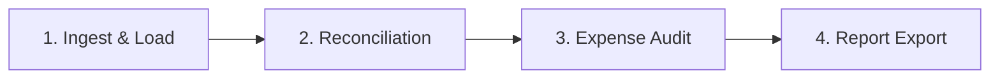

# ReconAI — Bank Reconciliation & Expense Audit Assistant

**ReconAI** is an enterprise-grade desktop application designed for **Chartered Accountants (CAs), Statutory Auditors, CFOs, and Tax Professionals**. It automates Bank Reconciliation Statements (BRS) and forensic expense compliance audits for Indian businesses, hospitals, traders, and corporate clients with high-speed deterministic matching and multi-provider AI reasoning.

---

## 🌟 Key Features

### 1. High-Performance Reconciliation Engine ($O(1)$ Hash Lookups)
* **Sub-3-Second Processing**: Matches 3,700+ transactions against 3,700+ ledger vouchers in ~2.3 seconds using candidate hash indexing.
* **4-Tier Matching Pipeline**:
  1. **Pass 1A (Exact Amount & Reference/Cheque)**: Matches identical amount and UTR/cheque/NEFT reference codes.
  2. **Pass 1B (Exact Amount & Same Date)**: Instant $O(1)$ pairing for transactions clearing on the exact voucher date.
  3. **Pass 1C (Timing Differences)**: Dynamic window tolerance (1 to 30 days) for cheque clearance delays.
  4. **Pass 2 (Fuzzy Narration Matching)**: RapidFuzz token sorting and ratio analysis for vendor abbreviations.
  5. **Pass 3 (AI Semantic Matcher)**: Uses Google Gemini or Anthropic Claude to resolve ambiguous, truncated, or highly unstructured bank narrations.
* **Full Audit Trail & Manual Override**: Interactive manual pairing/unpairing with multi-level **Undo (`Ctrl+Z`)** and **Redo (`Ctrl+Y`)** support.

### 2. Multi-Format Document Ingestion Engine
* **Bank Statements**: High-speed vector text parsing via `pypdfium2` (100+ page PDFs in < 1.5s) with seamless fallback to `pdfplumber`, CSV, Excel, Word (`.docx`), and scanned image OCR.
* **Client Books & Ledgers**: Automated parsing for Tally Prime exports, Excel workbooks (with smart multi-sheet account matching), and CSV ledger files.
* **Smart Memory Caching**: Avoids redundant re-parsing of large statement files when switching between sheets or exploring ledgers.

### 3. Comprehensive Client & Bank Account Master
* **Multi-Client Architecture**: Manage distinct client entities (Proprietorships, Partnerships, Pvt Ltd, Public Ltd, Hospitals, Trusts).
* **Multi-Bank Account Mapping**: Add multiple bank accounts (Current, CC/OD, Savings) with IFSC, Branch, and Account Type.
* **Multi-Book Management**: Link specific Tally/ERP books (e.g. *BOM CA Main Book*, *Eye Care Book*, *Cash Book*) directly to specific bank accounts.
* **Approved Vendor Whitelist**: Per-client vendor lists for automated procurement compliance.
* **Standing Auditor Remarks**: Pre-configure default compliance notes and audit scope per client.

### 4. Forensic Expense Audit & Indian Statutory Compliance
* **Same-Party Duplicate Payment Flagging**: Detects multiple debit payments issued to the same normalized vendor within a rolling date window, filtering out normal customer receipts.
* **Section 40A(3) Compliance**: Flags single-day cash payments exceeding statutory thresholds (₹10,000 / ₹35,000 for transport).
* **Section 194C / 194J TDS Compliance**: Detects contractor and professional fee transactions exceeding thresholds where TDS deductions are mandatory.
* **Statutory GSTIN Format Validation**: Validates 15-character Indian GST identification numbers (checksum, state code, PAN structure).
* **Round-Amount & Discretionary Spikes**: Highlights unusual round-sum vouchers (e.g. ₹50,000, ₹1,00,000) requiring senior approval.
* **Weekend & Holiday Postings**: Detects transactions recorded on non-business days (Saturdays/Sundays).

### 5. Interactive Legal Reasoning & Auditor Finding Editor
* Fully editable finding cards for every flagged risk exception.
* Live editing of:
  * ✏️ **Auditor Finding & Legal Reasoning**
  * ✏️ **Recommended Action for CA Team / Client Management**
  * 🏷️ **Risk Severity Level** (`HIGH`, `MEDIUM`, `LOW`, `INFO`)
* Direct persistence to SQLite database and automated inclusion in executive audit reports.

### 6. Dual-Model AI Architecture (Claude + Gemini)
* Toggle between **Google Gemini** (`gemini-2.5-flash`, `gemini-1.5-pro`) and **Anthropic Claude** (`claude-3-5-sonnet`, `claude-3-haiku`) directly in `⚙ Settings`.
* Secure local storage of API keys (`AIzaSy...` or `sk-ant-...`).

### 7. Executive Reporting & Export
* **Excel BRS Report (`.xlsx`)**: Professional multi-tab workbook containing Summary BRS, Matched Transactions, Unmatched Bank Records, Unmatched Ledger Vouchers, and Forensic Audit Exceptions with Excel formatting and mathematical totals.
* **Executive Forensic Audit Report (`.pdf`)**: Formatted PDF report with audit scope, visual status summaries, severity distributions, and itemized findings with legal rationale.

---

## 📂 Project Structure

```text
ReconAI/
├── reconai/                         # Core Python Package
│   ├── ai/                          # AI Client & Multi-Model Providers
│   │   ├── __init__.py
│   │   └── client.py                # Anthropic Claude & Google Gemini Client
│   ├── audit/                       # Forensic & Regulatory Rules Engine
│   │   ├── __init__.py
│   │   ├── ai_flagger.py            # AI Semantic Risk Analysis
│   │   ├── audit_manager.py         # Unified Audit Runner
│   │   └── rules_engine.py          # Indian Tax & Audit Rules Engine
│   ├── db/                          # Persistence Layer
│   │   ├── __init__.py
│   │   └── database.py              # SQLite DatabaseManager (Clients, Sessions, Logs)
│   ├── ingest/                      # Document Ingestion & Parsers
│   │   ├── __init__.py
│   │   ├── base_parser.py           # Parser Interfaces
│   │   ├── document_parser.py       # Word & Image Vision OCR Parser
│   │   ├── ledger_parser.py         # Tally Prime & ERP Excel/CSV Parser
│   │   └── statement_parser.py      # High-Speed PDF, CSV & Excel Bank Parser
│   ├── models/                      # Pydantic Domain Models
│   │   ├── __init__.py
│   │   ├── client.py                # ClientProfile, BankAccount, ClientBook
│   │   ├── session.py               # ReconciliationSession & Audit Trail
│   │   └── transaction.py           # StatementTransaction, LedgerEntry, MatchRecord
│   ├── reconcile/                   # Reconciliation Algorithms
│   │   ├── __init__.py
│   │   ├── ai_matcher.py            # LLM Narration Resolver
│   │   ├── deterministic.py         # O(1) Hash-Indexed Deterministic Matcher
│   │   ├── fuzzy.py                 # Candidate-Indexed RapidFuzz Matcher
│   │   └── matcher.py               # Multi-Pass Orchestrator
│   ├── report/                      # Export Builders
│   │   ├── __init__.py
│   │   ├── excel_exporter.py        # Styled Excel BRS Builder
│   │   ├── pdf_exporter.py          # Executive Audit PDF Generator
│   │   └── report_builder.py        # Unified Export Facade
│   ├── ui/                          # PyQt6 Graphical User Interface
│   │   ├── __init__.py
│   │   ├── components/              # Reusable UI Widgets (Tables, StatCards, Undo)
│   │   ├── theme.py                 # Modern Dark & Light Themes
│   │   ├── main_window.py           # Top Navigation Bar & Stacked Steps
│   │   ├── views/                   # 4 Step Views + Dialogs
│   │   │   ├── ingest_view.py       # Step 1: Ingestion & Sheet Selection
│   │   │   ├── reconcile_view.py    # Step 2: BRS Interactive Workspace
│   │   │   ├── audit_view.py        # Step 3: Forensic Risk & Findings Editor
│   │   │   ├── export_view.py       # Step 4: Final Report Generation
│   │   │   ├── client_master_dialog.py # Client, Bank & Book Master Dialog
│   │   │   └── settings_dialog.py   # AI Provider, Keys & Tolerances
│   │   └── workers/                 # QThread Background Processing
│   └── config.py                    # AppConfig & Robust Path Resolvers
├── packaging/                       # PyInstaller Packaging
│   └── reconai.spec                 # Windows Standalone Binary Spec
├── tests/                           # Automated Test Suite (35 Unit Tests)
├── config.json                      # Persistent Local Configuration
├── reconai.db                       # Local SQLite Database
├── requirements.txt                 # Python Dependencies
├── run.py                           # Application Launch Entrypoint
└── README.md                        # Documentation
```

---

## 🚀 Getting Started

### Prerequisites
* **Operating System**: Windows 10/11 (64-bit)
* **Python**: Python 3.10 to 3.14 (Recommended: Python 3.11+)

### Installation

1. **Clone or download the repository**:
   ```bash
   cd D:/ReconAI
   ```

2. **Create and activate a virtual environment (optional but recommended)**:
   ```bash
   python -m venv venv
   .\venv\Scripts\Activate.ps1
   ```

3. **Install dependencies**:
   ```bash
   pip install -r requirements.txt
   ```

---

## 💻 Running the Application

### Option A: Development Mode (Source Code)
Run the application directly using Python:
```bash
python run.py
```

### Option B: Standalone Executable (No Python Required)
If using the compiled binary, simply double-click:
```text
D:\ReconAI\dist\ReconAI.exe
```

---

## 📖 Step-by-Step Workflow Walkthrough



### Step 1: Ingest & Load
1. **Select Client**: Choose your client from the top dropdown (e.g. `SUN HEALTH CARE HOSPITAL` or `SIVANSHI TRADERS`), or click **`🏢 Client Master`** to register a new client profile.
2. **Select Bank Account**: Choose the corresponding active bank account from the dropdown.
3. **Upload Bank Statement**: Click **Browse File** under *Bank Statement Ingestion* and select your `.pdf`, `.xlsx`, or `.csv` file.
4. **Upload Client Books**: Click **Browse File** under *Client Books / Ledger Ingestion* and select your Tally `.xlsx` file.
5. **Select Sheet (if multi-sheet)**: If the workbook has multiple sheets (e.g. `Sheet1`, `Sheet2`, `IDFC BANK Book`), ReconAI will auto-select the highest-matching sheet or allow you to choose from the dropdown.
6. Click **`Parse & Normalize Files`** to verify transaction counts and balances.

### Step 2: Automated Reconciliation
1. Click **`▶ Run Automated Reconciliation & Audit`** (or navigate to tab `2. Reconciliation`).
2. The engine instantly pairs matching transactions across deterministic and fuzzy passes.
3. **Review Tabs**:
   * **Matched**: Pairs of cleared bank entries and ledger vouchers with confidence scores and reasoning.
   * **Probable**: Matches with timing differences or fuzzy narration variations requiring review.
   * **Unmatched Statement**: Bank charges, direct customer transfers, or unrecorded credits.
   * **Unmatched Ledger**: Cheques issued but not yet presented (timing differences) or erroneous entries.
4. **Interactive Overrides**:
   * Select a matched row and click **Unpair** to unlink.
   * Select one unmatched bank entry and one unmatched ledger voucher, then click **Pair Selected** to link manually.
   * Use **`Ctrl+Z`** to undo and **`Ctrl+Y`** to redo any action.

### Step 3: Forensic Expense Audit
1. Navigate to tab `3. Expense Audit`.
2. Inspect flagged risk items grouped by severity:
   * 🔴 **High Severity**: Suspected duplicate vendor payments, unapproved high-value vouchers, cash payments exceeding Section 40A(3).
   * 🟠 **Medium Severity**: TDS compliance checks (Sec 194C/194J), invalid GSTIN formats.
   * 🟡 **Low / Info**: Weekend journal entries, round-sum amounts, unapproved vendors.
3. **Edit Findings**:
   * Select an exception row from the table.
   * Edit the **Auditor Finding / Legal Reasoning** box on the right.
   * Edit the **Recommended Action for CA Team** box.
   * Change severity via dropdown if justified.
   * Click **`💾 Save & Apply Finding Changes`**.

### Step 4: Report Export
1. Navigate to tab `4. Report Export`.
2. Review the session audit trail and reconciliation statistics.
3. Click:
   * **`📊 Export Excel Reconciliation Report`**: Generates a multi-sheet `.xlsx` file with mathematical BRS reconciliations.
   * **`📄 Export Executive Audit PDF`**: Generates a board-ready executive audit findings summary.

---

## 🛠️ Building the Standalone Executable

To build or refresh the standalone Windows executable (`ReconAI.exe`):

1. Ensure all dependencies and PyInstaller are installed:
   ```bash
   pip install pyinstaller -r requirements.txt
   ```

2. Compile using the included spec configuration:
   ```bash
   pyinstaller packaging/reconai.spec --distpath dist --workpath build -y
   ```

3. The updated binary will be produced at:
   ```text
   D:\ReconAI\dist\ReconAI.exe
   ```

---

## 🧪 Running Automated Unit Tests

ReconAI includes a comprehensive test suite covering parsers, matchers, audit rules, persistence, and UI lifecycle:

```bash
python -m pytest -v
```

*Expected output*: `35 passed in ~2.5s`.

---

## ⚙️ Configuration Reference (`config.json`)

The application automatically reads and persists its settings to `config.json`:

```json
{
  "reconciliation": {
    "date_tolerance_days": 3,
    "amount_tolerance": "0.00",
    "fuzzy_narration_threshold": 75.0,
    "enable_ai_matcher": true,
    "ai_model": "gemini-2.5-flash",
    "api_key": "YOUR_API_KEY_HERE"
  },
  "audit": {
    "duplicate_date_window_days": 3,
    "round_amount_threshold": "25000.00",
    "high_value_approval_threshold": "50000.00",
    "flag_weekend_transactions": true,
    "enable_gst_tds_compliance": true,
    "approved_vendors": [
      "CHOKADOLA ASSOCIATES",
      "SURGICARE",
      "KPS Agencies"
    ],
    "enable_ai_audit": true
  },
  "theme": "dark",
  "db_path": "reconai.db"
}
```

---

## 🔒 Security & Privacy

* **Local Database**: All client master records, bank credentials, ledger vouchers, and audit trails reside in local SQLite databases (`reconai.db`). No client financial records are shared or stored on external cloud databases.
* **Direct AI API**: When using AI semantic matching or audit analysis, communication occurs directly between your workstation and Google/Anthropic via HTTPS using your own private API key.

---

## 📄 License & Ownership

Developed for Chartered Accountants, Audit Firms, and Financial Institutions. All rights reserved.
